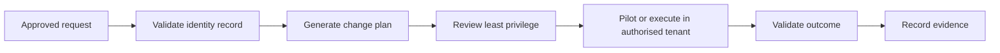

# Microsoft 365 Identity & Endpoint Administration Lab

[](https://github.com/isaacyanney/microsoft-365-identity-lab/actions/workflows/powershell-syntax.yml)

A portfolio lab for the operational design behind Microsoft 365, Entra ID and Intune administration. It demonstrates identity lifecycle planning, least-privilege access, Conditional Access rollout, endpoint compliance and reviewable PowerShell automation.

## Scope and evidence boundary

This repository is a reproducible **design and automation lab**. It does not claim deployment to a live Microsoft tenant. The sample domain, users and identities are synthetic. Live screenshots, exports and deployment results will only be added after they are produced in an authorised tenant.

## What the project demonstrates

- Joiner–Mover–Leaver identity controls
- Role- and group-based access planning
- Licence-profile planning
- MFA and Conditional Access design
- Intune enrolment and compliance design
- Safe pilot, exception and rollback procedures
- PowerShell validation and structured change plans
- Security-conscious administrative documentation

## Repository structure

```text
├── data/lab-users.csv
├── scripts/New-IdentityChangePlan.ps1
├── docs/joiner-mover-leaver.md
├── docs/intune-baseline.md
├── policies/conditional-access-baseline.md
└── .github/workflows/powershell-syntax.yml
```

## Generate a change plan

```powershell
.\scripts\New-IdentityChangePlan.ps1 `
  -InputPath .\data\lab-users.csv `
  -OutputPath .\output\identity-plan.json
```

The script validates each record and produces reviewable joiner, mover, leaver or access-review actions. It intentionally makes no Microsoft Graph calls and performs no tenant changes.

## Administrative workflow



## Live-lab completion checklist

- Connect an authorised test tenant
- Replace the `.example` domain with the verified tenant domain
- Implement Graph authentication using least-privilege permissions
- Run Conditional Access policies in report-only mode
- Test with dedicated pilot users and emergency-access accounts
- Export policy and sign-in evidence
- Document rollback tests and results

## Security principles

No passwords, tokens, MFA codes or private tenant data are stored here. Destructive account and device actions require explicit approval, ownership verification and an organisation-specific retention process.

## Author

**Isaac Lovelace Yanney** — IT Support & Technical Operations  
[GitHub](https://github.com/isaacyanney) · [LinkedIn](https://www.linkedin.com/in/isaac-lovelace-yanney/)
